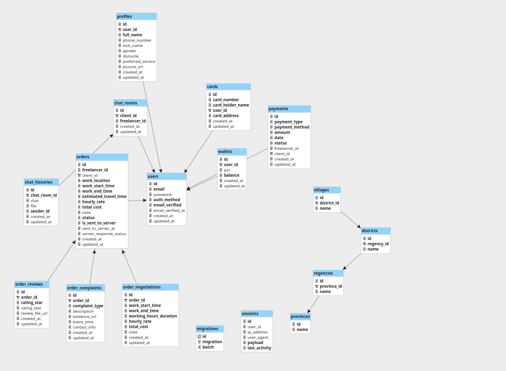

# kitaBantu Mobile Backend

This repository contains the **mobile backend service** for the `kitaBantu` mobile application, originally developed for **kitaBantu Indonesia**. The project has since been extended and maintained with improved documentation, architecture, and a cleaner developer experience.

This backend powers the mobile application, handling authentication, freelancer orders, real-time chat, and payment workflows.

📄 **API Documentation**  
View full API documentation via Swagger UI: [Swagger Link](http://localhost/#/)

---

## 🚀 Features

- **Authentication System**
  - JWT-based access control
  - Custom access and refresh tokens
  - Refresh tokens stored securely in Redis
- **Freelancer Ordering System**
  - End-to-end process for ordering freelancers
- **Real-Time Chat**
  - WebSocket-based implementation for real-time messaging
- **Payment Integration**
  - Integrates with Midtrans Core API
  - Supports card, bank transfer, e-money, and over-the-counter (OTC) payments

---

## 🧰 Tech Stack

| Layer            | Technology                            |
|------------------|----------------------------------------|
| Language         | PHP (Laravel), Go (for WebSocket)      |
| Database         | MySQL                                  |
| Cache            | Redis                                  |
| Messaging Queue  | RabbitMQ                               |
| Email Service    | Mailtrap (SMTP)                        |
| Real-time Comm.  | WebSocket                              |
| API Documentation| Swagger (OpenAPI)                      |
| Containerization | Docker (for development & production)  |
| CI/CD            | GitHub Actions                         |

---

## 📦 Architecture Note: RabbitMQ Integration

RabbitMQ is intended to act as a message broker for syncing data between the **web** and **mobile** backend services.  
As `kitaBantu Indonesia` plans to maintain separate backend systems for each platform, RabbitMQ was selected for:

- High performance and low latency
- Easy Laravel integration
- Strong community and plugin ecosystem
- Scalability for future microservices and asynchronous tasks

---

## 🗂️ Database Schema

Here's the database structure that powers the mobile backend:



## 🧑‍💻 Development

Clone the repository and use Docker to start the environment:

```bash
# Start development environment
make up-dev

# Start production environment
make up-prod